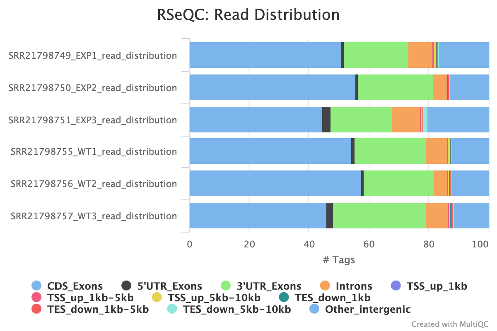

```{r setup, include=FALSE}
library(data.table)
library(tidyverse)
library(DESeq2)
library(magrittr)
knitr::opts_chunk$set(echo = TRUE)
```

# Introduction

Fertility is a major issue with 1 in 6 adults experiencing fertility issues [2]. In vitro fertilization (IVF) is a potential care path for couples experiencing fertility issues, but IVF success rates remain low [3]. Most research around poor IVF outcomes have revolved around the influence of maternal stressors and periconceptual health. 
Additionally, in the USA, alcohol use is widespread, however most studies exploring the interaction between alcohol and IVF focus on the female drinking or are significantly confounded by multiple lifestyle factors [1]. 

This report aims to investigate the relationship between paternal drinking and its impact on IVF embryos. The following [dataset](https://www.ncbi.nlm.nih.gov/geo/query/acc.cgi?acc=GSE214726) was used and data was collected by exposing paternal mice to alcohol free solution or 10% ethanol solution for 10 weeks. Sperm was collected and then used to fertilize eggs retrieved from alcohol free females. Oocytes underwent IVF and were incubated till the morula stage, at which point totalRNA was harvested and compared across control and experimental samples. The hypothesis under test is: Embryonic gene expression differs between embryos from paternal fathers that consume alcohol and those that don't. Specifically, there is a change in expression of Fgf4 and Egfr RNA expression.

## Dataset

The data is linked to the following publication - [Preconception paternal alcohol exposure decreases IVF embryo survival and pregnancy success rates in a mouse model](https://pmc.ncbi.nlm.nih.gov/articles/PMC9907225/).

- The data was generated by the Golding Lab at Texas A&M University in the department of Veterinary Physiology & Pharmacology.

- The RNA was extracted using the Quick Biololgy Inc. RNA isolation protocol. 
[Source](https://www.ncbi.nlm.nih.gov/geo/query/acc.cgi?acc=GSM6615000)

- The library was prepped using the Quick Biololgy Inc. library construction protocol.
[Source](https://www.ncbi.nlm.nih.gov/geo/query/acc.cgi?acc=GSM6615000)

- The experimental treatment/condition was defined by the Nakagata IVF protocol with CARD media. This is a method for extracting embryos from mice as defined in this [paper](https://pubmed.ncbi.nlm.nih.gov/30353518/)
[Source](https://www.ncbi.nlm.nih.gov/geo/query/acc.cgi?acc=GSM6615000)

- The Illumina NovaSeq 6000 platform was used for sequencing.

- There are 3 samples per condition (Experimental: 10% Alcohol Paternal Exposure, WT: Alochol Free Paternal Exposure)

- The data is paired-end

- The library is unstranded

# Results

Github for report: https://github.com/naraharip2017/ANGSD-pan4008/tree/main

Run scripts in following order to reproduce results in report:

1. download_samples.sh
2. run_preprocessing_fastqc.sh
3. trim_samples_run_fastqc.sh
4. align_reads.sh
5. run_feature_counts.sh
6. run_rseqc.sh

Through Differential Gene Expression Analysis, the hypothesis was supported that there were differences in transcript composition between embryos from paternal father that were exposed to alcohol and those that were not. Additionally, there was a downregulatin in the expression Fgf4 (Fibroblast growth factor 4) and Egfr (Epidermal growth factor), which are both critical regulators of trophectoderm stem cell growth and placental patterning. Along with similar findings to the paper that utilized this dataset, I also found differential gene expression of Gm14137 and Gbp10, both of which are believed to impact GTP binding activity [4][5]. The GO enrichment analysis also found changes in expression around development, specifically with the eyes and sensory systems. Further experiments could be conducted to perform direct KO of the genes differentially expressed in this report and directly monitor phenotypic changes to further understand their impact on a growing embryo. 

There are several limitations from the findings in this report. For example, the library was prepped using totalRNA, which captures abundant mRNA along with other non-protein coding RNAs. Additionally, as seen in the RSeQC results, there may be some degradation of transcripts causing a 3' bias and impacting what is seen in the results. Finally, since the experiments were conducted on mice, and it is difficult to know if the findings would translate well to humans and how embryos from different species would be impacted

# Methods

## Generating Alignment and Read Counts

### Downloading data

I first downloaded the data to my workspace using this [script](https://github.com/naraharip2017/ANGSD-pan4008/blob/main/scripts/download_samples.sh)

This created the directory structure with the SRR ID and sample type (experimental, WT) for tracking of the type of sample. Since the reads are paired-end there are two files per condition.

```
SRR21798749_EXP1  SRR21798750_EXP2  SRR21798751_EXP3  SRR21798755_WT1  SRR21798756_WT2  SRR21798757_WT3
```

```{bash readsPerCondition, eval=FALSE}
cd SRR21798749_EXP1
ls
```

```
SRR21798749_1.fastq.gz  SRR21798749_2.fastq.gz
```

### Pre-processing Data

Before performing alignments, I performed some quality control on the read files themselves. I first performed `fastqc` on the raw reads. I used two threads to process the two reads from paired-end reads. I used this [script](https://github.com/naraharip2017/ANGSD-pan4008/blob/main/scripts/run_preprocessing_fastqc.sh) to generate the fastqc reports

Investigating the reports, there were 0 sequences flagged for bad quality but there was adapter contamination.

```{r, fig.cap="Figure 1: Example FastQC report on pre-processed data showing adapter contamination - sample SRR21798749", out.width="70%"}
knitr::include_graphics("figure_imgs/pre_processed_adapter_reads.png")
```

I then ran the following [script](https://github.com/naraharip2017/ANGSD-pan4008/blob/main/scripts/trim_samples_run_fastqc.sh) which did the following steps:

1. `trim_galore` to remove the adapters from the reads. I passed Illumina because I knew that the sequencing was done on an Illumina platform. I outputted to a `trimmed/` directory per sample. 
2. `fastqc` was run on the trimmed samples and reports were investigated after to ensure samples removed adapters properly

After performing `fastqc` on the trimmed reads, the reports indicated adapters were removed and 0 poor quality reads still. However, the reports indicated `FAIL` for `Per base sequence content` so that may indicate a source of bias or error in subsequent analysis. Though looking at the plots for the samples, with an example below there looks to be a drop in A%, which may be due to the poly-A tail being trimmed. 


```{r, fig.cap="Figure 2: Example Post Trimmed FastQC report on pre-processed data showing adapter contamination - sample SRR21798749", out.width="70%"}
knitr::include_graphics("figure_imgs/post_trimmed_fastqc.png")
```

```{r, fig.cap="Figure 3: Example Post Trimmed FastQC report Per Base Sequence Content - sample SRR21798749", out.width="70%"}

```

### Creating Reference Genome

I downloaded a reference genome from ucsc as the publication linked to the dataset retrieved their data from the `UCSC m39` reference genome. I downloaded the `.fa` file and `.gtf` files from the following locations 

```{bash Q2DownloadRefGenome, eval=FALSE}
wget ftp://hgdownload.soe.ucsc.edu/goldenPath/mm39/bigZips/mm39.fa.gz
```

```{bash Q2DownloadRefGenomeGtf, eval=FALSE}
wget ftp://hgdownload.soe.ucsc.edu/goldenPath/mm39/bigZips/genes/refGene.gtf.gz
```

I then created a reference genome to perform an alignment for the RNA data

```{bash Q2DGenerateSTARRefGenome, eval=FALSE}
STAR --runMode genomeGenerate --runThreadN 10 --genomeDir Mus_musculusSTARindex/ --genomeFastaFiles mm39.fa --sjdbGTFfile refGene.gtf --sjdbOverhang 149
```

I used a sjdbOverhang of 149 because the length of the reads in my dataset are 150, and the help menu says to use `readLength-1` for the parameter

### Aligning Samples

I then ran the following [script](https://github.com/naraharip2017/ANGSD-pan4008/blob/main/scripts/align_reads.sh) to perform the alignment between the trimmed samples and the reference genome. I passed the parameter `--alignIntronMax 100000` so that reads that map to large intron junction as a technical artifact are removed from the mappings.

### Feature counts

I then ran the following [script](https://github.com/naraharip2017/ANGSD-pan4008/blob/main/scripts/run_feature_counts.sh) to run `featureCounts` to attribute genes to the alignments performed. I passed the parameters `-Q 10` to consider a minimum mapping quality per read of 10 to stay in line with the process from the original paper. I used the `refGene.gtf` from UCSC and passed `-p` and `--countReadPairs` to properly handle the paired-end reads. `-T 8` was passed to use additional threads.

The `featureCounts` produced a `musmusculus_fc.txt` output, which I then used for subsequent differential gene expression investigations. 

### Alignment QC

Prior to performing differential gene expression analysis, I performed QC on the  generated alignments for each sample. I ran `rseqc`, which required a BED file for the reference genome rather than a `.gtf` file. I utilized `UCSC` tools to generate a BED file from the earlier downloaded `refGene.gtf.gz` file. 

```{bash createBEDFile, eval=FALSE}
conda create --name pan4008 python=3.10
conda install -c bioconda ucsc-gtftogenepred ucsc-genepredtobed
gtfToGenePred refGene.gtf refGene.genePred
genePredToBed refGene.genePred refGene.bed
```

After creating the BED file, I then performed `rseqc` analysis on the aligned reads and the BED file through this [script](https://github.com/naraharip2017/ANGSD-pan4008/blob/main/scripts/run_rseqc.sh), and then ran multiqc for the read distribution and gene body coverage plots

```{bash generateRseqcPlots, eval=FALSE}
cd rseqc
conda activate multiqc
multiqc .
```

```{r, fig.cap="Figure 4: RSEQC Read Distribution Plot", out.width="70%"}

```

The read distribution plot shows some intergenic reads, showing a potential source of low quality reads.


```{r, fig.cap="Figure 5: RSEQC Gene Body Coverage Plot", out.width="70%"}
knitr::include_graphics("figure_imgs/rseqc_gene_body_coverage_plot.png")
```

The gene body coverage plot shows some bias towards the 3' end showing there may be some mRNA degradation occurring, which was captured in the library.

I then plotted the aligned reads per sample to make sure most were aligned. There looks to be some reads that were multimapped, ambiguous, or no features, which is something that may have impacted subsequent analysis.

```{r}
process_data_for_ggplot <- function(file, filter_categories) {
  summary_data <- read.table(file, header=TRUE, row.names = 1, sep = "\t")
  transposed_data <- as.data.frame(t(summary_data))
  transposed_data$Sample <- rownames(transposed_data)
  rownames(transposed_data) <- NULL
  transposed_data <- transposed_data %>% relocate(Sample)
  
  long_data <- transposed_data %>%
  pivot_longer(cols = -Sample, 
               names_to = "Status", 
               values_to = "Counts")
  
    sample_mapping <- c(
    "SRR21798749.SRR21798749.Aligned.sortedByCoord.out.bam" = "SRR21798749_EXP1",
    "SRR21798750.SRR21798750.Aligned.sortedByCoord.out.bam" = "SRR21798750_EXP2",
    "SRR21798751.SRR21798751.Aligned.sortedByCoord.out.bam" = "SRR21798751_EXP3",
    "SRR21798755.SRR21798755.Aligned.sortedByCoord.out.bam" = "SRR21798755_WT1",
    "SRR21798756.SRR21798756.Aligned.sortedByCoord.out.bam" = "SRR21798756_WT2",
    "SRR21798757.SRR21798757.Aligned.sortedByCoord.out.bam" = "SRR21798757_WT3"
  )

  long_data$Sample <- recode(long_data$Sample, !!!sample_mapping)

  long_data <- long_data %>%
    filter(Status %in% filter_categories)

  return(long_data)
}
```

```{r}
gene_count_data = process_data_for_ggplot("musmusculus_fc.txt.summary", c("Assigned", "Unassigned_Ambiguity", "Unassigned_NoFeatures", "Unassigned_MultiMapping"))

head(gene_count_data)

plot <- ggplot(gene_count_data, aes(x = Counts, y = Sample, fill = Status)) +
  geom_bar(stat = "identity", position = "dodge") +
  labs(x = "# Reads", y = "Sample", title = "Figure 6: Reads for Each Status Per Sample")

plot
```


## Reading Data into R and Post Alignment Processing

I first began by reading the `featureCounts` dataframe into R and generating plots to view differences in sequencing depths. While I do some processing to normalize the sequencing depth, I did not conduct further investigations, as the normalization was merely for data exploration. The subsequent differential gene expression is done on the raw read counts.

```{r load_counts_data}
df_counts <- read.table("musmusculus_fc.txt", header = TRUE)
new_names <- c(names(df_counts)[1:6], paste("EXP", c(1:3), sep = "_"), paste("WT", c(1:3), sep = "_"))
names(df_counts) <- new_names
str(df_counts)
row.names(df_counts) <- make.names(df_counts$Geneid)
cts_gene_sample <- df_counts[ , -c(1:6)]
head(cts_gene_sample)
```

```{r load_coldata}
df_coldata <- data.frame(condition = gsub("_[0-9]+", "", names(cts_gene_sample)),
row.names = colnames(cts_gene_sample))
```

```{r create_dds_object}
dds_musmusculus <- DESeqDataSetFromMatrix(countData = cts_gene_sample,
colData = df_coldata,
design = ~ condition)
df_rowdata <- df_counts[, 1:6]
rowData(dds_musmusculus) <- df_rowdata
dds_musmusculus
```


```{r view_data}
keep_genes <- rowSums(counts(dds_musmusculus)) > 0
dds_musmusculus <- dds_musmusculus[ keep_genes, ]
dim(dds_musmusculus)
colSums(counts(dds_musmusculus)) %>% 
  barplot(main = "Figure 7: Read Counts per Sample", xlab = "Samples", ylab = "Total Read Counts")
dds_musmusculus <- estimateSizeFactors(dds_musmusculus)
par(mfrow=c(1,2))
counts.sf_normalized <- counts(dds_musmusculus, normalized=TRUE)

boxplot(log2(counts(dds_musmusculus) +1), notch=TRUE,
main = "Figure 8: Non-normalized read counts",
ylab ="log2(read counts)", cex = .6)
boxplot(log2(counts(dds_musmusculus, normalized=TRUE) +1), notch=TRUE,
main = "Figure 9: Size-factor-normalized read counts",
ylab ="log2(read counts)", cex = .6)
```

### Run differential gene expression analysis with DESeq2

After loading and exploring the data, I then ran differential gene expression analysis using the created `DESeq2` object

```{r perform_dge, message=FALSE}
dds_musmusculus$condition %<>% relevel(ref="WT")

dds_musmusculus <- DESeq(dds_musmusculus)
DGE_results <- results(dds_musmusculus,
                       independentFiltering = TRUE,
                       alpha = 0.05,
                       saveCols="Length")
gene_list <- DGE_results$log2FoldChange
names(gene_list) <- rownames(DGE_results)
gene_list <- sort(gene_list, decreasing = TRUE)
```

Results were subsetted to just those genes whose adjusted p-values (after multiple hypothesis correction) pass our statistical threshold of 0.05. These are the genes that we are labeling as differentially expressed.

```{r get_deg}
DGE_genes <- subset(DGE_results, padj < 0.05)
DGE_genes <- DGE_genes[order(DGE_genes$padj), ]
top5_genes <- head(DGE_genes, 5)
knitr::kable(top5_genes, caption = "Table 2: Top 5 Differentially Expressed Genes (sorted by adjusted p-value)")
```

### Go Term Enrichment Analysis

For GO term enrichment analysis, the vector of differentially expressed genes (`DGE_genes`) was used and Revigo was used to generate a tree plot.

```{r load_ora_packages, message=FALSE}
#BiocManager::install(c("clusterProfiler", "enrichplot", "DOSE"))
library(clusterProfiler)
library(enrichplot)
library(ggplot2)
library(DOSE)
library(org.Mm.eg.db)
```

```{r perform_go_ora}

organism <- "org.Mm.eg.db"
res_go <- enrichGO(gene=rownames(DGE_genes),
                   universe=rownames(dds_musmusculus),
                   ont="ALL",
                   keyType="SYMBOL",
                   minGSSize = 3,
                   maxGSSize = 800,
                   pvalueCutoff = 0.05,
                   OrgDb = organism,
                   pAdjustMethod = "BH")
```

After generating the `res_go` object, statistically significant categories were saved and used to generate a tree plot

```{r save_ora_result}
write.table(res_go@result[ , c("ID", "pvalue")],
            file="enrichGO.txt", sep="\t",
            quote=FALSE, row.names=FALSE)
```

```{r }
# A treemap R script produced by the Revigo server at http://revigo.irb.hr/
# If you found Revigo useful in your work, please cite the following reference:
# Supek F et al. "REVIGO summarizes and visualizes long lists of Gene Ontology
# terms" PLoS ONE 2011. doi:10.1371/journal.pone.0021800

# author: Anton Kratz <anton.kratz@gmail.com>, RIKEN Omics Science Center, Functional Genomics Technology Team, Japan
# created: Fri, Nov 02, 2012  7:25:52 PM
# last change: Fri, Nov 09, 2012  3:20:01 PM

# -----------------------------------------------------------------------------
# If you don't have the treemap package installed, uncomment the following line:
# install.packages( "treemap" );
library(treemap) 								# treemap package by Martijn Tennekes

# Set the working directory if necessary
# setwd("C:/Users/username/workingdir");

# --------------------------------------------------------------------------
# Here is your data from Revigo. Scroll down for plot configuration options.

revigo.names <- c("term_ID","description","frequency","value","uniqueness","dispensability","representative");
revigo.data <- rbind(c("GO:0001654","eye development",0.1216277557122956,3.6424884043228785,0.06484803948255154,0,"eye development"),
c("GO:0035116","embryonic hindlimb morphogenesis",0.002823171826409047,3.5180768194372356,0.3215505326331961,0.43461821,"eye development"),
c("GO:0048880","sensory system development",0.12498750248042843,3.610254658231879,0.21424196420905625,0.57523702,"sensory system development"));

stuff <- data.frame(revigo.data);
names(stuff) <- revigo.names;

stuff$value <- as.numeric( as.character(stuff$value) );
stuff$frequency <- as.numeric( as.character(stuff$frequency) );
stuff$uniqueness <- as.numeric( as.character(stuff$uniqueness) );
stuff$dispensability <- as.numeric( as.character(stuff$dispensability) );

# check the tmPlot command documentation for all possible parameters - there are a lot more
treemap(
  stuff,
  index = c("representative","description"),
  vSize = "value",
  type = "categorical",
  vColor = "representative",
  title = "Figure 10: Revigo TreeMap for Go Enriched Terms",
  inflate.labels = FALSE,      # set this to TRUE for space-filling group labels - good for posters
  lowerbound.cex.labels = 0,   # try to draw as many labels as possible (still, some small squares may not get a label)
  bg.labels = "#CCCCCCAA",   # define background color of group labels
								 # "#CCCCCC00" is fully transparent, "#CCCCCCAA" is semi-transparent grey, NA is opaque
  position.legend = "none"
)
```

As the tree plot shows, differential RNA expression was found across development, especially eye and sensory system formation indicating that the experimental condition may have had some impact on fundamental developmental processes.

# Discussion

I ran into the following issues during my analysis.

1. During alignment viewing in IGV, I found there were many poor reads with large intron junctions, which would completely bypass whole genes. This is a result of technical mapping artifacts and not actually transcripts due to exon splicing. I re-ran my alignments to avoid these technical intron junctions by passing a parameter `--alignIntronMax`
2. During `featureCounts` execution, I initially only passed `-p` flag for handling paired-end reads, but I also needed to pass `--countReadPairs`` to properly process paired-end reads. 
3. `RSeQC` took a while to run because I could not convert the `refGene.gtf` file to the proper `BED12` format needed. Initially, I converted to `BED6` format using an AWK command, which caused errors with `RSeQC`. Eventually through some research online I found the UCSC tools to convert the `refGene.gtf` to `BED12` and was able to run `RSeQC`

I feel some limitations of the study include using sperm and eggs from different mice, as this could introduce additional biases that may not be solely based on the experimental condition. Additionally, 10% ethanol solution corresponds to a 75 kg man consuming 12 beers in 4 h every day. While this is possible, it would be great to see results for less consumption of alcohol and its impact on IVF. The dataset does include 6% ethanol consumption, which corresponds with 4 beers consumed daily.

```{r datasetsDiscussion}
datasets <- data.frame(
  Dataset = c("MusMusculus Feature Counts", "Go Term Enrichment", "Top 5 Differentially Expressed Genes"),
  Reasoning = c(
    "The feature counts table was kept for further data investigation and maintaining counts of transcript expression per sample",
    "The Go Term enrichment was kept as an analysis of the feature counts data",
    "The Differentially expressed dataset was kept in the report for additional analysis of the feature counts table and understanding the major differences that occurred between experimental and WT samples"
  ),
  stringsAsFactors = FALSE
)

knitr::kable(datasets, caption = "Table 3: Key Datasets during Analysis")
```


# References

[1] Roach AN, Zimmel KN, Thomas KN, Basel A, Bhadsavle SS, Golding MC. Preconception paternal alcohol exposure decreases IVF embryo survival and pregnancy success rates in a mouse model. Mol Hum Reprod. 2023 Jan 31;29(2):gaad002. doi: 10.1093/molehr/gaad002. PMID: 36637195; PMCID: PMC9907225.

[2] Purity Njagi, Wim Groot, Jelena Arsenijevic, Silke Dyer, Gitau Mburu, James Kiarie, Financial costs of assisted reproductive technology for patients in low- and middle-income countries: a systematic review, Human Reproduction Open, Volume 2023, Issue 2, 2023, hoad007, https://doi.org/10.1093/hropen/hoad007

[3] Zargar M, Dehdashti S, Najafian M, Choghakabodi PM. Pregnancy outcomes following in vitro fertilization using fresh or frozen embryo transfer. JBRA Assist Reprod. 2021 Oct 4;25(4):570-574. doi: 10.5935/1518-0557.20210024. PMID: 34224240; PMCID: PMC8489809.

[4] Gbp10 Guanylate-Binding Protein 10 https://www.ncbi.nlm.nih.gov/gene/626578

[5] Gm14137 https://www.ncbi.nlm.nih.gov/gene/623781


Make sure every QC, process says WHY I did it
clean up